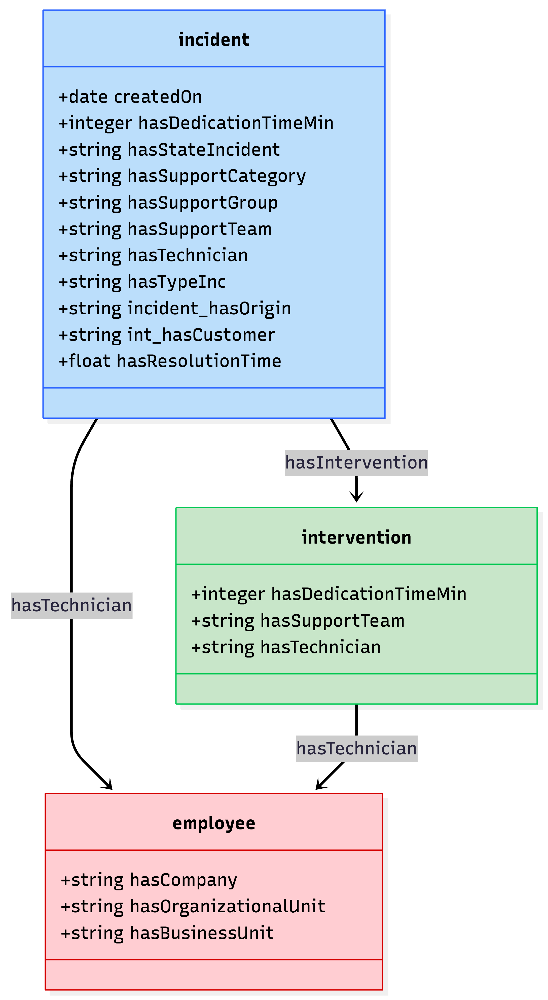
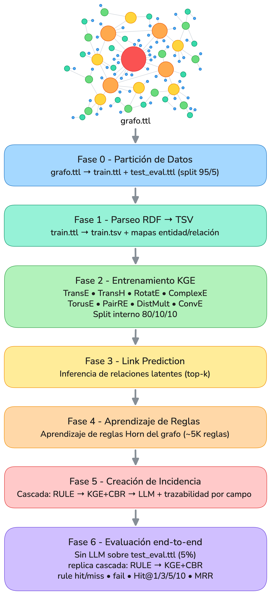
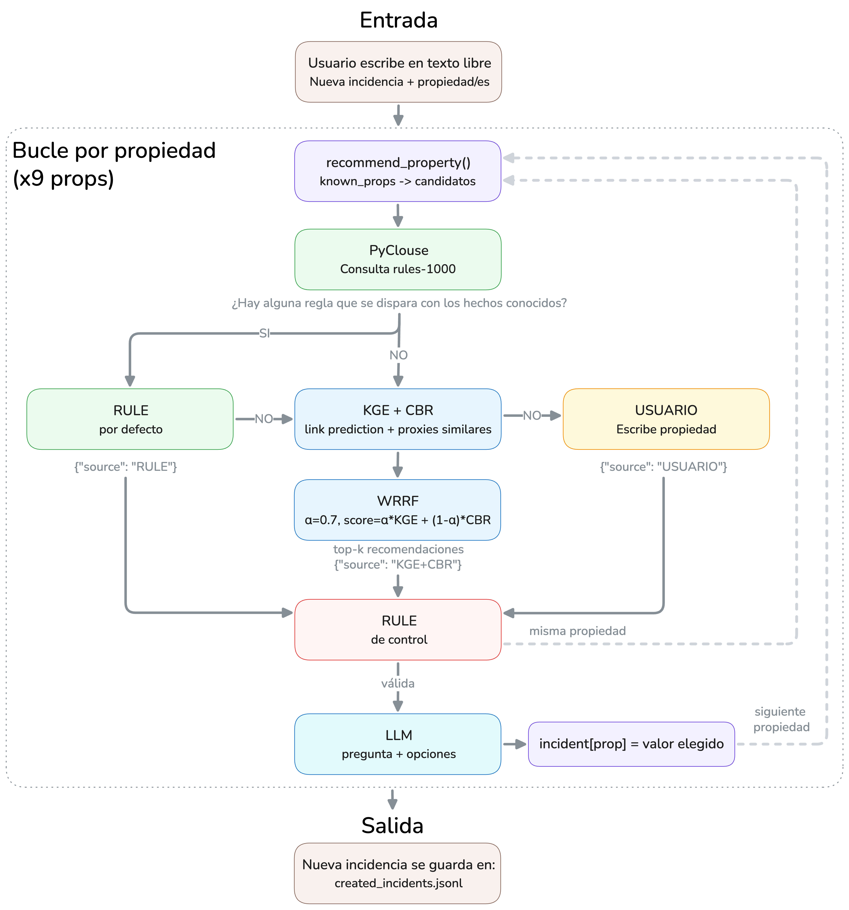

# LLM-KGE: Creación guiada de incidencias con Grafos de Conocimiento

## Descripción

Este proyecto implementa un sistema **neuro-simbólico end-to-end** para la creación guiada de incidencias técnicas. El sistema combina tres fuentes de conocimiento en una **inferencia en cascada**, garantizando que siempre hay una respuesta y que cada sugerencia lleva su fuente de trazabilidad:

<!--
| Capa | Método | Fuente | Cuándo actúa |
|------|--------|--------|--------------|
| 1 | Reglas simbólicas Horn (AnyBURL + PyClause) | `RULE` | Si existe una regla aplicable (y el usuario no la rechaza) |
| 2 | Link prediction KGE + recuperación CBR (fusión WRRF) | `KGE` / `CBR` | Si no hay regla, o el usuario rechaza la regla |
| 3 | LLM conversacional (verbalización + extracción) | `USUARIO` | Siempre (interfaz) |
-->

| Capa | Método | Fuente | Cuándo actúa |
|------|--------|--------|--------------|
| 1 | Reglas simbólicas Horn (AnyBURL + PyClause) | `RULE` | Si existe una regla aplicable |
| 2 | Link prediction KGE + recuperación CBR | `KGE+CBR` | Si no hay regla |
| 3 | LLM conversacional (verbalización) | `USUARIO` | Siempre (interfaz) |

La capa de reglas es **determinista y explicable**; el KGE+CBR es el **fallback probabilístico** que siempre devuelve candidatos. El LLM nunca inventa valores: solo formula preguntas y extrae la elección del usuario entre opciones verificadas por el grafo.

**Dominio**: gestión de incidencias técnicas en español.

**Entidades**: incidencias, técnicos (internos/externos), clientes, grupos/equipos/categorías de soporte, estados, tipos, orígenes, intervenciones.

---

## Modelo Semántico

<p align="center">
  
</p>

---

## Requisitos Previos

- Python 3.11+
- Java 17+ (para AnyBURL)
- GPU NVIDIA (recomendada para entrenamiento KGE y servidor vLLM)
- Git

---

## Instalación

### 1. Crear un entorno virtual

```bash
python3 -m venv venv
source venv/bin/activate
```

### 2. Instalar dependencias

```bash
pip install -r requirements.txt
```

**Instalar PyClause** (motor de reglas):

```bash
git clone https://github.com/symbolic-kg/PyClause
cd PyClause
pip install -e .
```
<!--
### 3. Configurar Hugging Face 🤗

```bash
pip install huggingface-hub
hf auth login
```

**Obtener tu token de Hugging Face:**

- Ve a https://huggingface.co/settings/tokens
- Crea un nuevo token con permisos de lectura 🔑
- Usa la configuración mostrada en la imagen:


- Introduce el token cuando se te solicite ✍️
-->
---

## Configuración de Servidores

### Servidor vLLM

Arranca el servidor en una terminal separada (requerido para las fases que usan LLM):

```bash
vllm serve meta-llama/Meta-Llama-3-8B-Instruct \
    --port 8000 \
    --dtype float16 \
    --max-model-len 4096 \
    --tool-call-parser llama3_json
```
<!--
> **Nota sobre la GPU**: vLLM reserva casi toda la VRAM. Por eso, durante `create_incident` el modelo KGE se carga en **CPU** (el scoring de unos pocos proxies es trivial) y la GPU queda libre para vLLM. El entrenamiento (fase 2) y la evaluación (`6`) sí usan GPU.

---
-->

<!--
## Estructura del Repositorio

```
KGE_master_tesis/
├── data/
│   ├── incident_triplets.ttl    # Grafo RDF fuente de incidencias
│   ├── train_full.ttl           # Train (95%) — generado por fase 0
│   ├── test_eval.ttl            # Eval  (5%)  — generado por fase 0
│   ├── reglas/
│   │   └── train_full_incidents/
│   │       └── rules-1000        # Reglas AnyBURL para incidencias (~5K reglas)
│   ├── triples/
│   │   └── train.tsv            # Tripletas planas (fase 1); el split 80/10/10
│   │                            #   se hace en memoria dentro de la fase 2
│   └── evaluacion/              # JSONL de evaluación (build_eval)
├── src/
│   ├── config.py                 # Parámetros globales y rutas
│   ├── phase0_split.py           # incident_triplets → train_full.ttl + test_eval.ttl
│   ├── phase1_triples.py         # Parseo RDF → TSV + mapas
│   ├── phase2_kge_train.py       # Entrenamiento KGE (8 modelos PyKEEN)
│   ├── phase2_plots.py           # Curvas de loss + t-SNE (sin reentrenar)
│   ├── phase3_link_prediction.py # Link prediction (relaciones latentes)
│   ├── phase4_learn_rules.py     # (opcional) Reglas Horn AnyBURL: split + learn
│   ├── phase5_incident_creator.py# Creador guiado (RULE → KGE+CBR → LLM)
│   ├── phase6_build_eval.py      # Prepara el JSONL de evaluación (build_eval)
│   ├── phase6_eval_incident_creator.py # Evaluación end-to-end (6)
│   ├── utils/                     # Helpers (NO son fases; los importan las fases)
│   │   ├── graph_utils.py        # Carga de grafos RDF, labels, plantillas ES
│   │   ├── rule_engine.py        # Motor de reglas simbólico (PyClause + AnyBURL)
│   │   └── llm_inference.py      # Cliente vLLM + verbalización de propiedades
│   ├── rules/                     # Toolchain de reglas Horn (Fase 4, opcional)
│   │   ├── split_train_full.py   # Divide train_full.ttl en splits temáticos
│   │   └── learn_rules_splits.py # Aprende reglas AnyBURL por split
│   └── run_pipeline.py           # Orquestador del pipeline
├── figuras/                      # Diagramas, t-SNE, comparativas
├── out/
│   ├── maps/                     # entity_to_id / relation_to_id (compartidos)
│   ├── models/<modelo>/          # Modelos KGE entrenados (PyKEEN)
│   ├── embeddings/<modelo>/      # Embeddings (.pt)
│   ├── predictions/              # Relaciones latentes inferidas
│   ├── evaluation/
│   │   └── incident_creator_full/# Resultados de la evaluación 6
│   └── logs/                     # Trazas de ejecución con timestamp
├── requirements.txt
└── README.md
```
-->
---

## Ejecución del Pipeline paso a paso

<p align="center">
  
</p>

> Las dependencias entre fases son: **0 → 1 → 2 → 3 → 5 (create_incident)**, con la **fase 4 (reglas, opcional)** colgando de la fase 0, y **build_eval → 6** para la evaluación.

### Fase 0 — Partición de Datos (split train/eval)

```bash
python src/run_pipeline.py --phase 0
```

Divide `data/incident_triplets.ttl` en `train_full.ttl` (95%) y `test_eval.ttl` (5%). El conjunto de eval se mantiene **fuera** del entrenamiento y del pool CBR para no contaminar las métricas.

---

### Fase 1 — Parsear el grafo a tripletas TSV

```bash
python src/run_pipeline.py --phase 1
```

**Entrada**: `data/train_full.ttl`
**Salida**:
- `data/triples/train.tsv` (todas las tripletas de entrenamiento, sin split en disco)
- `out/maps/entity_to_id.json`, `out/maps/relation_to_id.json`

El split 80/10/10 (train/valid/test) se realiza **en memoria** dentro de la fase 2, propagando el mismo vocabulario de entidades a todos los splits.

---

### Fase 2 — Entrenar el modelo KGE (TransE por defecto)

```bash
python src/run_pipeline.py --phase 2
```

Entrena con CUDA automáticamente. Modelos disponibles: **TransE, RotatE, TransH, HAKE, DistMult, ComplEx, TorusE, PairRE**.

**Salida**:
- `out/models/<modelo>/` (modelo completo + training factory PyKEEN)
- `out/embeddings/<modelo>/{entity,relation}_embeddings.pt`

**Otras opciones**:

```bash
# Elegir otro modelo
python src/run_pipeline.py --phase 2 --kge-model TransE

# Entrenar todos los modelos secuencialmente (genera comparativa)
python src/run_pipeline.py --phase 2 --all-models

# Regenerar curvas de loss + t-SNE sin reentrenar
python src/run_pipeline.py --phase 2_plots --kge-model TransE

# Ajustar hiperparámetros
python src/run_pipeline.py --phase 2 --epochs 50 --dim 64 --device cpu
```

---

### Fase 3 — Inferencia de relaciones latentes (link prediction)

```bash
python src/run_pipeline.py --phase 3
python src/run_pipeline.py --phase 3 --kge-model TransE
```

**Salida**: `out/predictions/implicit_relations.json` (top-K predicciones implícitas por entidad).

---

### Fase 4 — Aprender reglas Horn con AnyBURL (opcional)

Aprende reglas simbólicas sobre splits temáticos del grafo. Es **opcional**, requiere Java y queda **fuera de `--phase all`** (las reglas cambian poco y el aprendizaje es lento). Un solo comando ejecuta los dos pasos:

```bash
python src/run_pipeline.py --phase 4
```

Internamente [`phase4_learn_rules.py`](src/phase4_learn_rules.py) orquesta:

1. **`split_train_full.py`** — divide `data/train_full.ttl` por tipo de entidad del sujeto (`incident_`, `intervention_`, `employee_`) y genera en `data/train_splits/` los ficheros `train_full_incidents.ttl`, `train_full_interventions.ttl`, `train_full_incidents_interventions.ttl`, `train_full_interventions_employees.ttl` y `train_full_employees.ttl`.
2. **`learn_rules_splits.py`** — procesa cada `train_full_*.ttl` de forma independiente: convierte `.ttl → .tsv`, escribe un `config-learn.properties` y ejecuta AnyBURL, guardando las reglas de cada split en `data/reglas/<nombre_del_split>/`. Descarga el JAR de AnyBURL e instala Java si falta.

Las reglas quedan listas para cargarse en la fase 5 (`create_incident`) y en la evaluación (`6`) mediante PyClause. También puedes ejecutar cada script por separado (`python src/rules/split_train_full.py`, `python src/rules/learn_rules_splits.py`).

**Criterios aplicados** (`src/rules/learn_rules_splits.py`):
- Soporte mínimo: **10** predicciones correctas (`THRESHOLD_CORRECT_PREDICTIONS`)
- Confianza mínima: **0.7** (`THRESHOLD_CONFIDENCE`)
- Snapshots en **100 / 500 / 1000** (`rules-100`, `rules-500`, `rules-1000`)
- Predicados excluidos del aprendizaje: `hasDedicationTimeMin`, `createdOn`, `hasIntervention`.

---

### Fase 5 — create_incident: crear una incidencia guiada (RULE → KGE+CBR → LLM)

Para cada campo de la incidencia el sistema sigue la **inferencia en cascada**:

<p align="center">
  
</p>

1. **RULE** — PyClause comprueba si alguna regla AnyBURL infiere el valor. Si la hay, muestra la sugerencia con `rule_id` y `confidence`.
   - Aceptas (`s`/`Enter`) → el valor queda con fuente `RULE`.
   - **Rechazas (`n`/`no`)** → se descarta esa regla para el campo y se pasa a KGE+CBR.
2. **KGE+CBR** — Recupera incidencias similares (CBR) y puntúa candidatos con el KGE; ambos rankings se combinan por **Weighted Reciprocal Rank Fusion (WRRF)** (`W_KGE=0.7`, `W_CBR=0.3`, `RRF_K=60`).
3. **LLM** — Verbaliza la pregunta y extrae la respuesta libre del usuario contra las opciones verificadas.

Cada valor queda etiquetado con su fuente: `USUARIO`, `RULE`, `KGE+CBR`. Lo que menciones en el **texto libre inicial** (p. ej. `company__9G1G3MV0P`, `typeIncident__2`) se detecta y se rellena por adelantado, saltando ese campo.

> El KGE corre en **CPU** en esta fase para no competir con vLLM por la GPU.

**Sin LLM** (menú numerado, no requiere vLLM):
```bash
python src/run_pipeline.py --phase create_incident --no-llm
```

**Con LLM conversacional** (requiere vLLM en `localhost:8000`):
```bash
python src/run_pipeline.py --phase create_incident
```

**Cambiar el modelo KGE**:
```bash
python src/run_pipeline.py --phase create_incident --kge-model TransE
```

---

### Fase 6 — Evaluación end-to-end

**1) Construir el conjunto de evaluación** (extrae incidencias de `test_eval.ttl` a un JSONL; los campos ausentes se marcan `skip`):

```bash
python src/run_pipeline.py --phase build_eval            # 500 por defecto
python src/run_pipeline.py --phase build_eval --n 1000
```

**2) Evaluar la cascada** sobre ese JSONL:

```bash
python src/run_pipeline.py --phase 6
python src/run_pipeline.py --phase 6 --kge-model TransE
python src/run_pipeline.py --phase 6 --eval-jsonl data/evaluacion/test_eval_500.jsonl
```

Para cada incidencia y campo:
- Se intenta la **regla**: si acierta → `rule_hit` (rank=1); si propone otro valor → `rule_miss` → KGE+CBR.
- **KGE+CBR**: si el valor real está en el top-K → `kge_hit` (con su rank); si no → `fail`.
- Los campos marcados `skip` se omiten.

**Salida**: `out/evaluation/incident_creator_full/<timestamp>/{results.json, per_property.csv, predictions.csv}` (Hit@1/3/10 por propiedad, presencia de proxies CBR, integridad del ranking).

---

### Pipeline completo (fases 0 → 1 → 2 → 3 → create_incident)

```bash
python src/run_pipeline.py --phase all
```

---

## Configuración

Todos los parámetros centralizados en `src/config.py`:

| Parámetro | Valor | Descripción |
|-----------|-------|-------------|
| `EMBEDDING_DIM` | 256 | Dimensión de embeddings KGE |
| `N_EPOCHS` | 100 | Épocas de entrenamiento |
| `BATCH_SIZE` | 5500 | Batch size (reduce si hay OOM en GPU) |
| `NEG_PER_POS` | 10 | Negativos por tripleta positiva |
| `TRAIN_RATIO` / `VALID_RATIO` | 0.80 / 0.10 | Split interno en fase 2 (test = 0.10) |
| `RRF_K` | 60 | Constante de suavizado WRRF (estándar IR) |
| `W_KGE` / `W_CBR` | 0.7 / 0.3 | Pesos de la fusión KGE+CBR (suman 1) |
| `VLLM_BASE_URL` | `http://localhost:8000/v1` | Endpoint del servidor vLLM |
| `DEFAULT_MODEL` | `meta-llama/Meta-Llama-3-8B-Instruct` | Modelo LLM |
| `MAX_NEW_TOKENS` | 128 | Tokens máximos de respuesta |
| `TOP_K_PREDICT` | 10 | Top-K en link prediction |
| `RULES_FILE` | `data/reglas/train_full_incidents/rules-1000` | Reglas AnyBURL |

---

## Logs de ejecución

Cada ejecución de `run_pipeline.py` genera automáticamente un log en `out/logs/` con timestamp y fase:

```
out/logs/pipeline_20260610_140847_phasecreate_incident.log
out/logs/pipeline_20260610_090011_phaseall.log
```

El fichero captura toda la salida de la terminal (progreso, métricas, errores).

<!--
---

## Literatura de Referencia

| Paper | Autores |
|-------|---------|
| *Let Your Graph Do the Talking: Encoding Structured Data for LLMs* | Perozzi et al. (2024) |
| *Injecting Knowledge Graphs into Large Language Models* | Coppolillo (2024) |
| *Talk Like a Graph: Encoding Graphs for Large Language Models* | Fatemi et al. (2024) |
| *Can Knowledge Graphs Reduce Hallucinations in LLMs? A Survey* | Agrawal et al. (2024) |
| *Neurosymbolic AI for Enhancing Instructability in Generative AI* | Sheth et al. (2023) |
| *Anytime Bottom-Up Rule Learning for Large-Scale KG Completion* | Meilicke et al. (VLDB 2023) |
| *PyClause — Simple and Efficient Rule Handling for Knowledge Graphs* | Betz et al. (IJCAI 2024) |
-->
